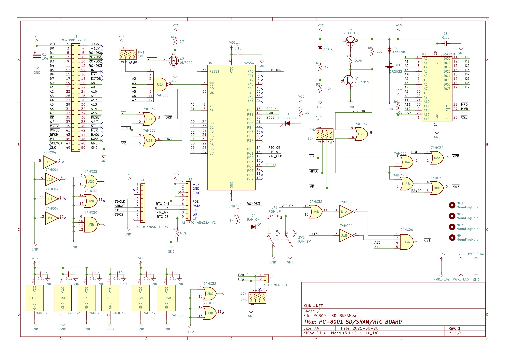
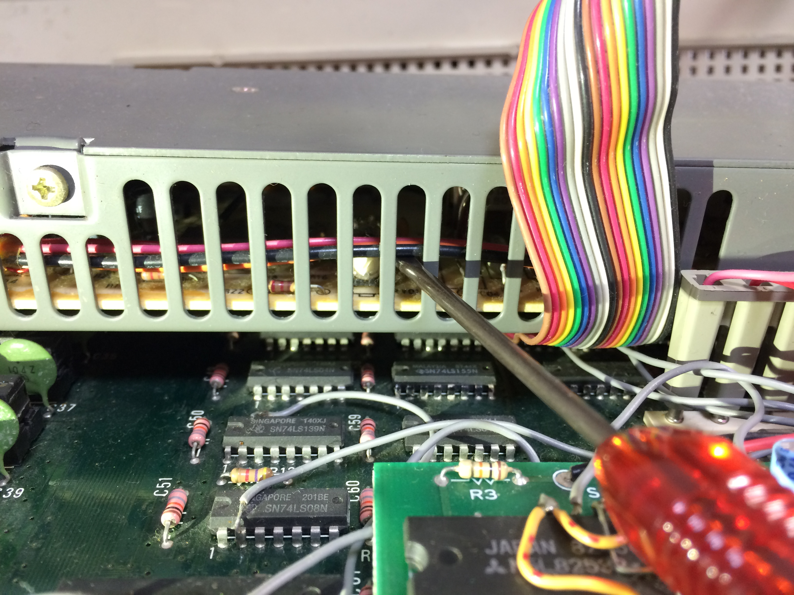

# PC-8001 8kB SRAM/MicroSD/RTCボード

## 概要

* PC-8001 拡張CPUバスにつながる8kB SRAM、MicroSD、RTC搭載ボードです。
* SD-DOSが動きます。

## 部品表
* 部品表は以下のCSVファイルを参照ください。
  * [部品表](KiCAD/PC8001-SD-8kRAM.csv)

## 回路図

## 稼働させる際の注意 
### ★電圧調整の際はテスタで計測しながら、トリマは慎重にまわしてください。ちょっと動かすだけで6Vなどの電圧が出ます。PC-8001のメインボードのICが壊れる可能性があります。

* PC-8001の電源電圧が下がっている場合があります。外部基板としてつなげた本基板にきている電圧が4.5Vなどになっていると安定しません。PC-8001の電源ユニット内の調整トリマを回して5V程度出るようにしてください。
* [2022/1/8追記] 回路図のツェナーダイオードの定格をRD4.2 → RD3.6としました。本体電圧を調整することなく安定すると思われます。

## 参考

* SD-DOS
  * https://github.com/chiqlappe/SD-DOS
* PC-8001 MicroSDボード
  * https://github.com/chiqlappe/sdd
* PC-8001 8k SRAMボード
  * https://github.com/chiqlappe/ram8k
* PC8001 RTCドライバー
  * https://github.com/chiqlappe/rtc
